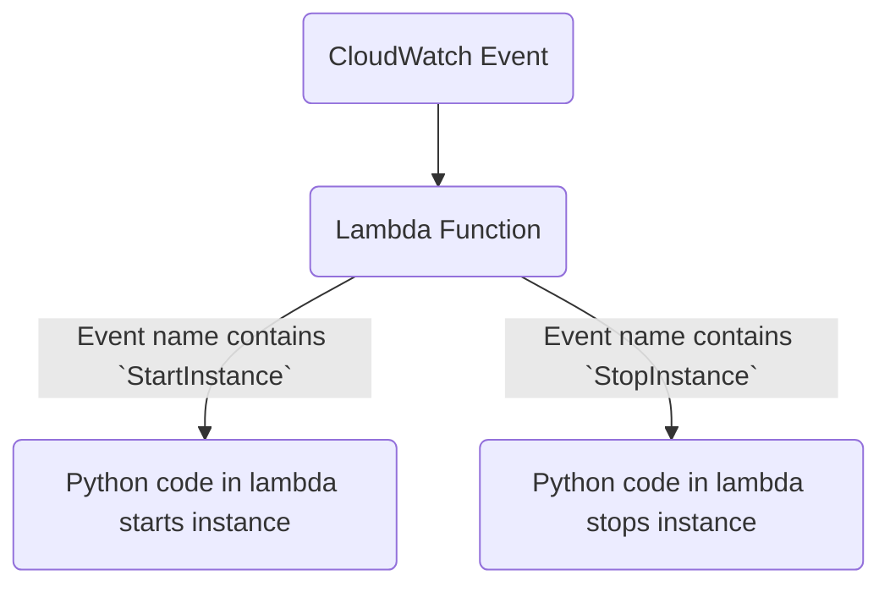

# instance-scheduler

This Repo contains the Python code and steps to create the instance start/stop scheduler using the attached Python script. 

## Prerequisite 

The following are the pre-requisites

- AWS account
- Admin access to the AWS Account

## Configuration and usage


High-level Flow

CloudWatch schedules are created with the names Start/Stop instance, respectively. `StartInstance10` indicates that the instance start event should be generated (10 can tell the time) and triggers the lambda function.

The Lambda Function takes two inputs, the event name as well as the list of instances to take action on; checks if the event name contains either the `StartInstances` or `StopInstances` in the events, then takes respective actions on the instance list that is passed, if it does not have any of the event names then print the log stating that event name detected is `XYZ` and hence ignoring the events. 

The code is dynamic and can work for any instance ID passed. The caveat is that the instance should belong to the same region as the one in which the lambda function is created.

Below are the minimal permissions that could be given to the lambda function so that it would not be able to perform any other actions. We can still function tight the permission by introducing the conditions statement with the specific instance-id, but that would defeat the purpose of the dynamic code, and every time we add a new instance to the instance list, we have to add it in IAM Permissions as well. 

```
{
    "Version": "2012-10-17",
    "Statement": [
        {
            "Sid": "VisualEditor0",
            "Effect": "Allow",
            "Action": [
                "ec2:DescribeInstances",
                "ec2:StartInstances",
                "ec2:StopInstances"
            ],
            "Resource": "*"
        }
    ]
}
```
